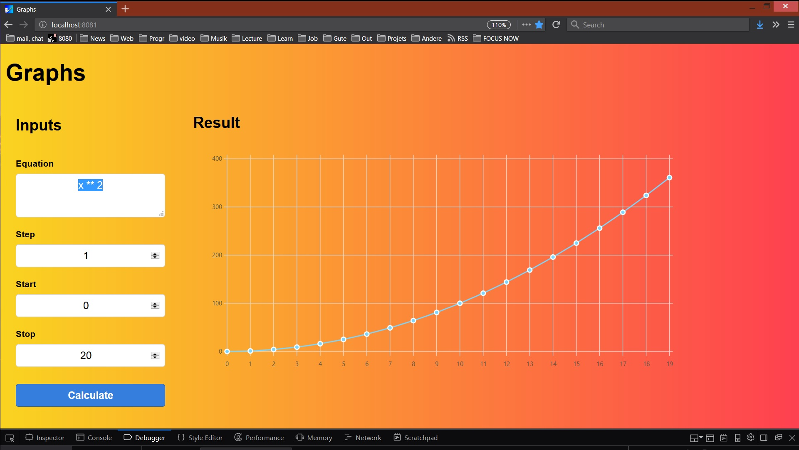

# graphs

Draw a curve on a 2D graph, with given function, start, stop and step.

## todo

solve bug 2/x --> division by 0 display something or filter result out yes filter it out before chart.update_values 

whitelist commands for equation

2 inputs and see where they cross.

display some help

document the fact that you can  use x and before and all JS math operators

use worka when it takes too long (80 points)

, use multiple when above certain treshrold (1000 ?)

Make it abortable with controller abort same as fetch see mdn

omits points in the graph when too many (80)

number placeholder looks ugly because of padding

make it work under IE9 and others

provide noscript and canvas fallback

## About tachyons

-ns not small

-m medium

-l large

